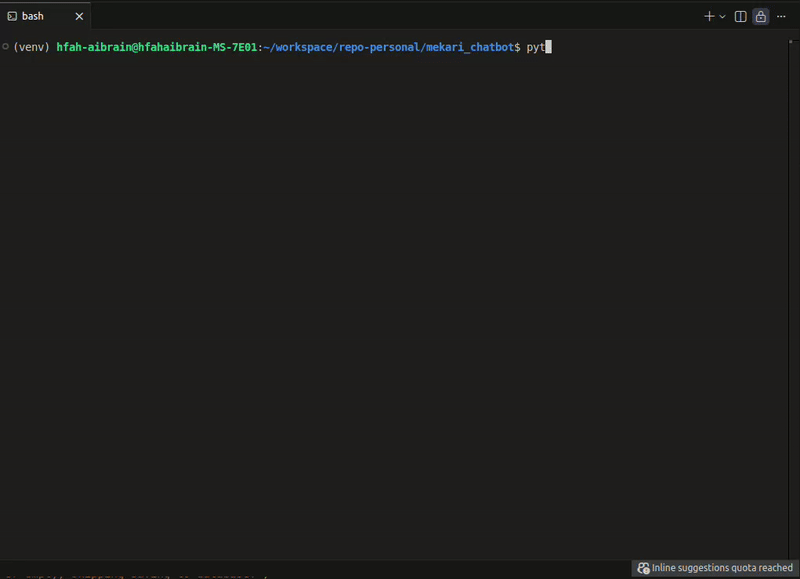
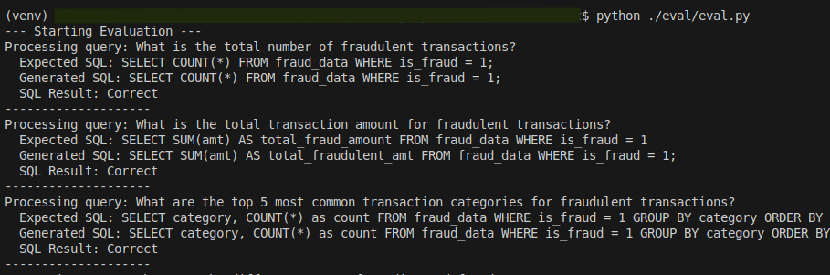

# Nokcha - Fraud Q&A Chatbot

Nokcha agent is an AI Assistant that fuses tabular data and documents into clear fraud insights. It uses a combination of a vector database (FAISS) for knowledge retrieval and a SQL database (SQLite) for structured data queries. The assistant is powered by `deepagent` built as REST API service.

## Features

- **Fraud Detection Expertise:** The chatbot is designed to be an expert in fraud detection, capable of answering questions about fraud detection methods, algorithms, and documents.
- **Transactional Data Queries:** The chatbot can query a database of transaction records to provide insights into specific transaction data, statistics, and trends.
- **Chat Interface:** The chatbot streams responses back to the user for a more interactive experience.
- **Extensible Knowledge Base:** The chatbot's knowledge base can be extended by adding more PDF documents to the `data` directory.
- **Comprehensive Logging:** The application now includes detailed logging for easier debugging and monitoring.

## Demo

Video and GIF stored on `./assets/`.

### Chatbot Interface



### Evaluation Script



## Methods

- **Deep agent Integration** : The core of this chatbot is a `deepagent`, a standalone library for building agents that can tackle complex, multi-step tasks. Built on LangGraph and inspired by applications like Claude Code, Deep Research, and Manus, deep agents come with planning capabilities, file systems for context management, and the ability to spawn subagents. [[Documentation]](https://docs.langchain.com/oss/python/deepagents/overview)

- **Tabular Data Processing**: The system automatically processes and ingests CSV files from the `engine/data` directory. It uses the `pandas` library to read, clean, and concatenate these files into a single DataFrame. This DataFrame is then stored in a SQLite database (`fraud.db`) within the `media` directory. This approach is efficient for handling structured transactional data and allows for powerful and fast querying using standard SQL.

- **Document Data Processing**: For unstructured data, the system processes PDF files from the `engine/data` directory. It uses the `docling` library to parse the PDFs, extracting text content while ignoring irrelevant elements like headers or footers. The extracted text is then chunked into smaller, semantically coherent pieces. Each chunk is then converted into a vector embedding using OpenAI's embedding models and stored in a FAISS vectorstore. This method, known as Retrieval-Augmented Generation (RAG), allows the agent to find and use relevant information from documents to answer questions.

- **Agent Tools**: The `deepagent` is equipped with two primary tools:
    1.  `query_sql`: This tool allows the agent to execute read-only `SELECT` queries against the SQLite database. It includes important safety guardrails that prevent any destructive operations (like `UPDATE`, `DELETE`, `DROP`), ensuring the integrity of the data. This is a robust way to give the agent access to structured data.
    2.  `query_vector_db`: This tool enables the agent to perform semantic searches on the FAISS vectorstore. It retrieves document chunks that are most relevant to the user's query, providing the agent with the necessary context from the knowledge base.

- **LLM Engine**: The reasoning and language capabilities of the agent are powered by OpenAI's `gpt-4o-mini` model. This model is responsible for understanding the user's query, planning which tool to use, generating the appropriate SQL or search query, and synthesizing the final answer based on the retrieved information.

## Architecture

The project is divided into two main components:

- **`engine`:** This directory contains the core logic of the chatbot.
  - `main.py`: The FastAPI application that exposes the chatbot's functionality through a REST API.
  - `agent.py`: The implementation of the fraud detection agent.
  - `faiss_manager.py`: A manager for the FAISS vector database, which stores and retrieves knowledge from PDF documents.
  - `sqlite_manager.py`: A manager for the SQLite database, which stores and queries transaction data.
  - `utils.py`: A collection of utility functions for data processing and file handling.
- **`interface`:** This directory contains a simple Streamlit interface for interacting with the chatbot.
  - `main.py`: Streamlit application entry point.
- **`eval`:** This directory contains a evaluation scripts.
  - `eval.py`: This script will execute evaluation method, interacting with chatbot through REST API.


## Setup and Installation

1. **Clone the repository:**
   ```bash
   git clone https://github.com/hfahrudin/fraud-chatbot.git
   cd fraud-chatbot
   ```

2. **Create .env file:**
   - Create a `.env` file from the `.env.example` and add your OpenAI API key:
     ```bash
     cp .env.example .env
     # Add your OpenAI API key to the .env file
     ```

4. **Prepare Data (CSV and PDF files):**
   - Create a `data` folder inside the `engine` directory: `mkdir engine/data`
   - Download your CSV and PDF data files relevant to fraud detection.
   - Place all downloaded CSV files (e.g., `transactions.csv`) and PDF documents (e.g., `fraud_guide.pdf`) into the `engine/data` folder.
     (Note: If you don't have data, the application will still run but with limited functionality for querying.)

5. **Run the application using Docker Compose:**
   - Build and start the services:
     ```bash
     docker-compose up --build
     ```
   **Note:** The initial build and setup might take a significant amount of time as it involves downloading `docling` dependencies (e.g., `torch`, `opencv-python`) and initializing the vector and SQL databases. Please be patient.

## Usage

Once the application is running via Docker Compose, you can access the Streamlit interface in your browser (usually at `http://localhost:8501`). The FastAPI engine will be running internally within the Docker network. You can ask questions about fraud detection or query the transaction data through the Streamlit interface.

To stop the application:
```bash
docker-compose down
```

## Evaluation

The project includes an evaluation script (`eval/eval.py`) to assess the performance of the SQL query generation and RAG (Retrieval-Augmented Generation) capabilities.

### How to Run Evaluation

1.  **Ensure the application is running:** The evaluation script needs the FastAPI engine to be running.
    ```bash
    docker-compose up -d
    ```
2.  **Install evaluation dependencies:**
    ```bash
    pip install -r eval/requirements.txt
    ```
3.  **Run the evaluation script:**
    Navigate to the `eval` directory and run the script.

    ```bash
    python eval/eval.py
    ```
    By default, this script uses `evaluation_dataset.csv` for evaluation.

    To use a custom CSV dataset for evaluation, specify it using the `--csv_file` argument:

    ```bash
    python eval/eval.py --csv_file my_custom_evaluation_data.csv
    ```

### Metrics

-   **SQL Evaluation:** Measures the accuracy of generated SQL queries against expected queries. Queries are robustly normalized using `sqlparse` for a less rigid comparison, ignoring differences in case, whitespace, aliases (`AS` clauses), and semicolon.
-   **RAG Evaluation:** Uses the ROUGE-L F1 score to measure the lexical similarity between the generated RAG answers and the expected ground truth responses. A higher ROUGE-L F1 score indicates better similarity.

## Logging

The application now uses the `logging` module to provide detailed logs of its operations. The logs are configured in `engine/main.py` and are printed to the console. The log format includes the timestamp, logger name, log level, and message. This makes it easier to monitor the application's behavior and troubleshoot any issues that may arise.
